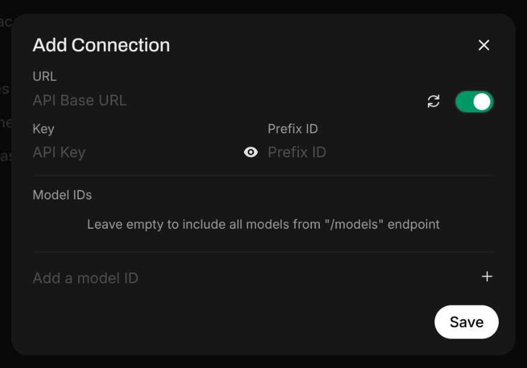

##  Introduction
Open WebUI is a popular selfhosted AI chat interface, but it's just a frontend, you need some kind of backend that would run the AI models. You could selfhost them with Ollama, but not everyone has powerful hardware, let alone pay for expensive VPS. This is where [NanoGPT](https://nano-gpt.com/) comes in. It's a pay-per-prompt AI access provider, which also provides a centralized API access for any model you could think of. Thereby eliminating the need to pay multiple companies for their API. And they accept crypto payments!

I've been using the NanoGPT website to chat for a while, but there was a problem. Since NanoGPT saves chats locally in the browser, I can't access them on my phone. Lucky for me, NanoGPT released a OpenAI-compatible chat endpoint, which allows me to integrate this provider into virtually anything that accepts such endpoints. So I combined Open WebUI with NanoGPT for the benefit of cheap prices, good looks, variety of models, and cross-device access. I also used Tailscale and TSDProxy for easy remote access.

In this guide I will show you how to set this up. However, I will not cover everything. See prerequisites for what you need to have in place before you begin.

## Prerequisites

- Linux server. I'm using [Ubuntu 24.04.2 LTS Server](https://ubuntu.com/download/server)
- SSH or direct access to the server
- Docker installed [Downloads page](https://docs.docker.com/engine/install/)
- TSDProxy installed [Installation](https://almeidapaulopt.github.io/tsdproxy/docs/getting-started/)
- HTTPS certificates enabled for your tailnet [DNS settings](https://login.tailscale.com/admin/dns)

I will assume that you already have a Tailscale account. You can register [here](https://login.tailscale.com/start).
Let's get started.

## Installing Open WebUI
The [documentation is here](https://docs.openwebui.com/), now follow these steps.
Once again, you will need TSDProxy set up and running for this to work.

1. Run this command to pull and run the container. Make sure containers host port is not already occupied, in case it is, change `3000` to some other port, e.g. `3001`. 
```
sudo docker run -d -p 3000:8080 -v open-webui:/app/backend/data --label "tsdproxy.enable=true" --name open-webui ghcr.io/open-webui/open-webui:main
```

2. Got to you Tailscale dashboard to click "Approve device" to approve Open WebUI container into your tailnet.
3. Go to FQDN of your Open WebUI. E.g. `https://open-webui.funny-name.ts.net/`
4. Register an account. First one to do so will becomes an administrator. First come first served 😁

## Connecting Open WebUI to NanoGPT
NanoGPT is a paid service, but they accept deposits as little as 0.10$, whether it's crypto or with credit card, so it's fine in my book.

1. Go to the [API](https://nano-gpt.com/api) page and create an API key.
2. In you Open WebUI instance, Go to Admin Panel, click "Settings" tab, then click "Connections" menu and enable OpenAI API Connections. Click the + sign to create a connection. Then you are presented this window:


3. In the URL field, input `https://nano-gpt.com/api/v1`
4. In the Key field, paste your API key.
5. Then to add a model, see [API](https://nano-gpt.com/api) page again and choose what model you want to use. Let's say you want to use Deepseek R1, so you go and find the appropriate model ID for it. That would be `deepseek-r1-nano`. After that don't forget click the + sign as well as the Save button.

Done! Now you can use your chosen AI model for chatting, and they will be accessible across your tailnet devices.

## Customization
Icons and descriptions are still missing. Let's fix that.

1. From where we left off, navigate to "Models" vertical tab, then click the edit button for your AI model.
2. Open new browser tab and go to this [website](https://lobehub.com/icons) and look for the icon of your AI model. Download it. Then upload the icon.
3. The rest is self-explanatory.

By the way, if your Open WebUI container goes down, since it was created with a `docker run` command, you will need to run this to start it again.
```
sudo docker start open-webui
```

Cover background by [hassaanhre](https://unsplash.com/@hassaanhre) on [Unsplash](https://unsplash.com/photos/abstract-blue-shapes-appear-to-float-in-the-air-aVjegSvlFHk/)
